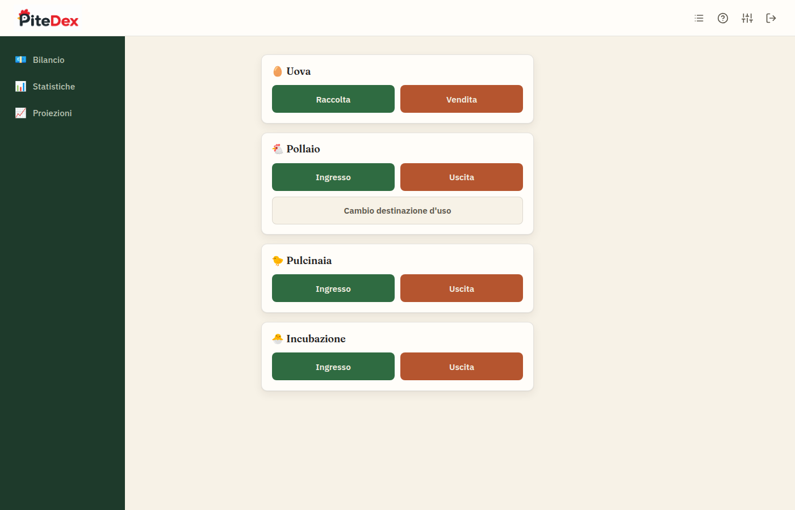
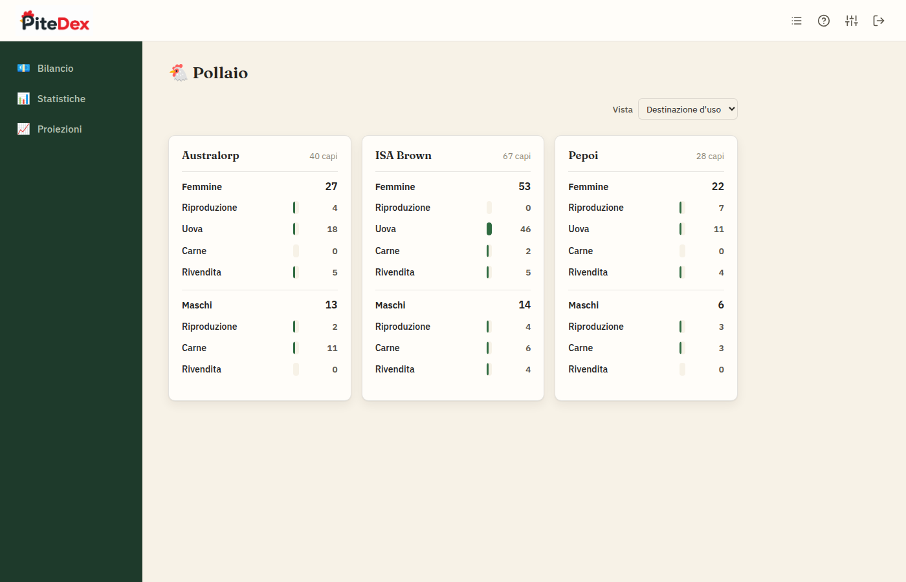
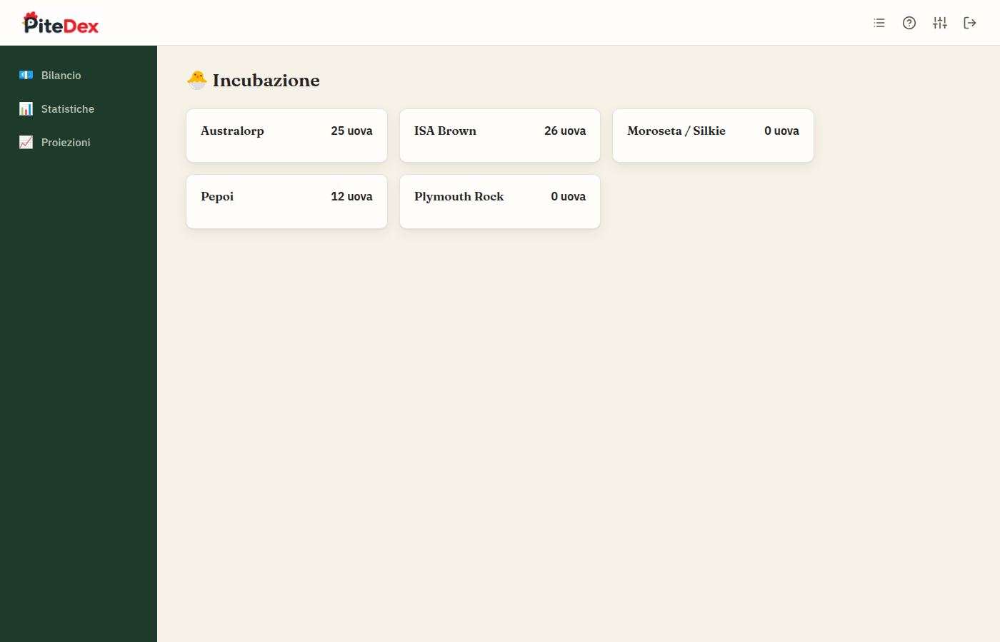
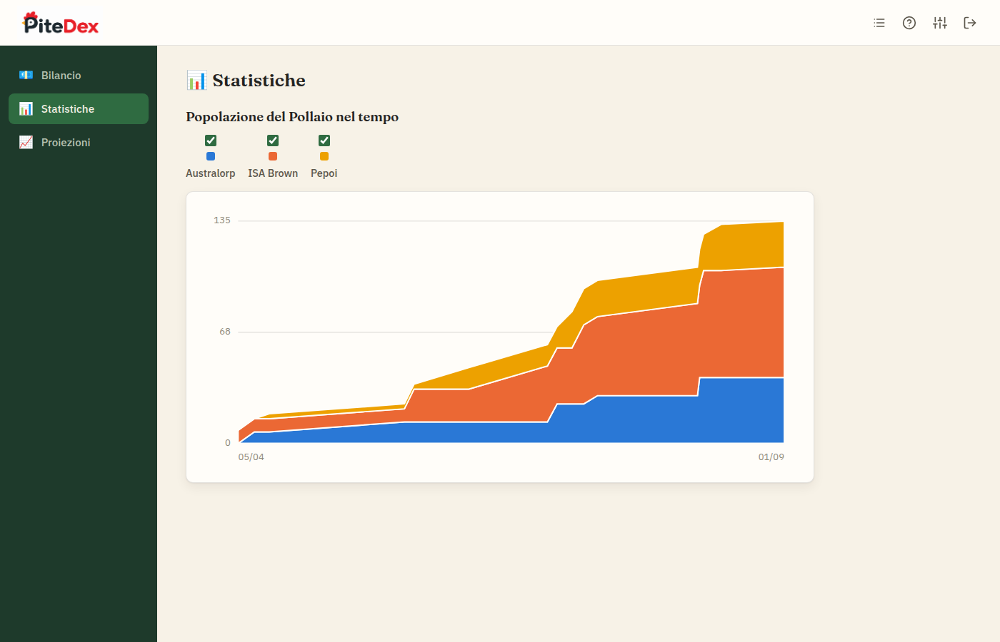
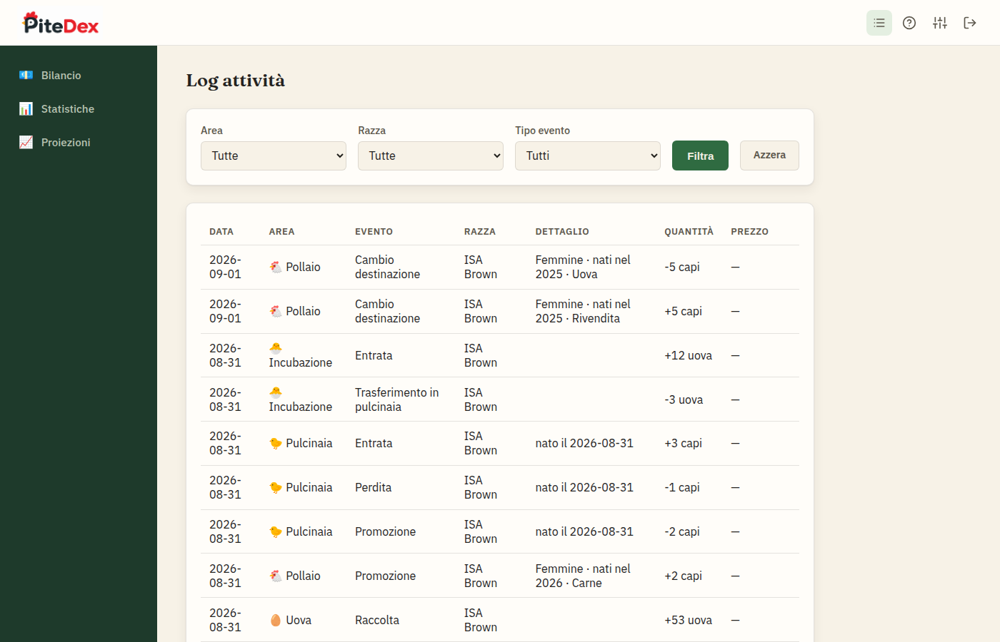
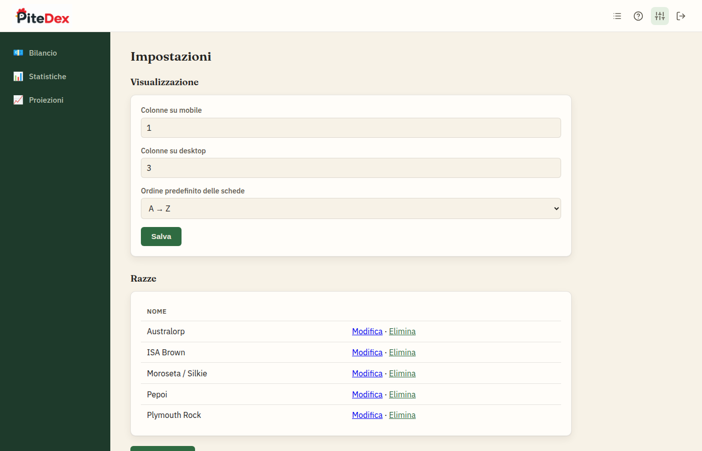
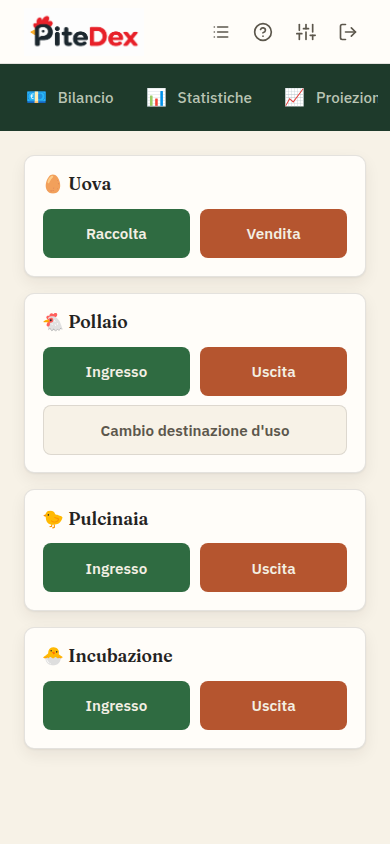

# 🐔 PìteDex

Gestionale per un piccolo allevamento avicolo a conduzione familiare: tiene traccia di uova,
pulcini e galline attraverso le quattro fasi dell'allevamento — **Incubazione**, **Pulcinaia**,
**Pollaio** e **Uova** — senza bisogno di calcolare nulla a mano.

Ogni movimento (un ingresso, un'uscita, una raccolta, una vendita...) viene registrato come un
evento. Tutti i numeri che vedi nell'app — quanti capi ci sono, quante uova sono in attesa,
quante ne hai vendute — sono calcolati al volo sommando questi eventi: non esistono contatori
da aggiornare manualmente, e lo storico completo resta sempre consultabile.



## Indice

- [Le quattro aree](#le-quattro-aree)
- [Funzionalità](#funzionalità)
- [Screenshot](#screenshot)
- [Stack tecnico](#stack-tecnico)
- [Avvio in locale](#avvio-in-locale)
- [Struttura del progetto](#struttura-del-progetto)
- [Modello dati](#modello-dati)

## Le quattro aree

L'allevamento segue il percorso naturale degli animali:

```
🐣 Incubazione  →  🐤 Pulcinaia  →  🐔 Pollaio
                                      ↕
                                   🥚 Uova
```

Le uova fecondate vanno in **Incubazione**. Quando si schiudono, i pulcini passano in
**Pulcinaia** per crescere. Quando sono abbastanza grandi, entrano nel **Pollaio**, dove restano
fino a quando vengono vendute, macellate, o cambiano destinazione d'uso. Parallela a queste tre
c'è **Uova**, che segue le uova deposte dalle galline già nel pollaio (destinate al consumo o
alla vendita, non alla schiusa).

Ogni razza vive per conto suo: non serve indicare "in quale pollaio" o "in quale gabbia" — la
razza stessa identifica il gruppo.

## Funzionalità

- **Azioni rapide** come pagina principale: un riquadro per area, con due pulsanti colorati
  (Ingresso/Uscita, o Raccolta/Vendita per le uova) per registrare un movimento in un paio di
  tocchi, pensata per l'uso sul campo da cellulare
- **Schede per razza** in ogni area, con il totale sempre in evidenza; nel Pollaio, suddivisione
  per sesso e tre viste alternative (destinazione d'uso, sesso, anno di nascita)
- **Selezione del gruppo guidata**: cascata di menu (razza → sesso → anno di nascita →
  destinazione) che mostra sempre quanti capi sono disponibili, per non rischiare di far uscire
  più capi di quanti ce ne siano davvero
- **Log attività**: cronologia completa di tutti i movimenti registrati, in qualsiasi area, con
  filtri per area/razza/tipo evento
- **Statistiche**: andamento della popolazione del pollaio nel tempo, un grafico ad area
  impilata con una banda per razza, selezionabili singolarmente
- **Impostazioni**: gestione delle razze (nome, modifica, eliminazione) e preferenze di
  visualizzazione (colonne e ordinamento delle schede, separate per mobile e desktop)
- **Login con sessione persistente**: un'unica coppia di credenziali condivisa, pensata per un
  accesso familiare, non per dover accedere ogni volta
- **Installabile come app**: icona e manifest per aggiungere PìteDex alla schermata Home del
  telefono con la sua icona, non quella generica del browser
- **Manuale integrato** nell'app stessa, per chi la usa in stalla senza aver bisogno di leggere
  questo file

## Screenshot

| | |
|---|---|
|  Pollaio: schede per razza, suddivisione per sesso e destinazione d'uso |  Incubazione: uova in attesa per razza |
|  Pulcinaia: pulcini per razza |  Registro uova: giacenza per razza |
|  Statistiche: popolazione del pollaio nel tempo, per razza |  Log attività: cronologia filtrabile di tutti gli eventi |
|  Impostazioni: razze e preferenze di visualizzazione |  Azioni rapide da cellulare |

## Stack tecnico

Deliberatamente minimale, nessun frontend framework:

- **[Flask](https://flask.palletsprojects.com/)** (Python) — backend e rendering server-side
- **SQLite** — un solo file, nessun server di database da gestire
- **Jinja2** — template, nessuna build JavaScript
- **CSS e JavaScript scritti a mano** — nessuna dipendenza da npm, nessun bundler; i grafici
  (stacked area in Statistiche) sono SVG generati via JavaScript puro

## Avvio in locale

```bash
git clone https://github.com/ncldlbn/pitedex.git
cd pitedex
python3 -m venv venv
source venv/bin/activate
pip install -r requirements.txt
python3 app.py
```

L'app crea da sola `pollaio.db` al primo avvio (schema vuoto + qualche razza di base). Apri
`http://127.0.0.1:5000`.

Variabili d'ambiente opzionali (utili soprattutto in produzione, dove vanno impostate a un
valore reale invece del default di sviluppo):

| Variabile | Scopo | Default |
|---|---|---|
| `SECRET_KEY` | Firma i cookie di sessione | valore fisso di sviluppo, **da cambiare in produzione** |
| `DEMO_USERNAME` | Utente per il login | `admin` |
| `DEMO_PASSWORD` | Password per il login | `1234` |

## Struttura del progetto

```
app.py              # routing, logica di business, aggregazione eventi
schema.sql           # schema SQLite (tabelle eventi + razze + impostazioni)
templates/            # pagine Jinja2 (server-rendered)
static/               # CSS, JS (cascata selezione gruppo, grafici, controlli vista)
```

Non c'è un livello di modelli/ORM separato: le query di aggregazione (es. "quanti capi ci sono
per razza/sesso/destinazione in questo momento") vivono direttamente in `app.py`, vicino alle
route che le usano.

## Modello dati

Nessuna tabella tiene un "numero attuale" salvato: ogni tabella evento (`eventi_incubatrice`,
`eventi_pulcinaia`, `eventi_pollaio`, `eventi_registro_uova`) è un log append-only. Lo stato
presente — e quello storico, a qualunque data passata — si ricava sempre sommando gli eventi con
il segno giusto a seconda del tipo (un ingresso somma, un'uscita sottrae).

I capi non hanno un'identità individuale né di lotto: due animali con le stesse caratteristiche
(razza, sesso, anno di nascita, destinazione d'uso per il Pollaio; razza e data di nascita per la
Pulcinaia) sono fungibili e appartengono allo stesso "pool". Questo tiene il modello semplice ed
è coerente con come funziona davvero un piccolo allevamento: non si tracciano i singoli animali,
si contano i gruppi.

---

Progetto personale, nessuna licenza d'uso dichiarata.
